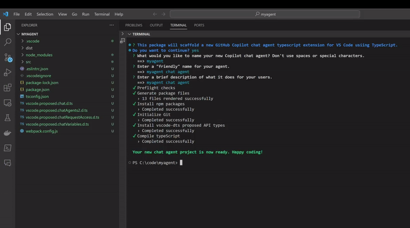
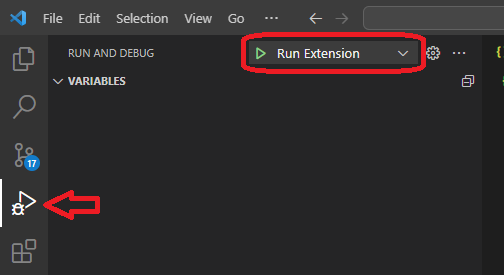
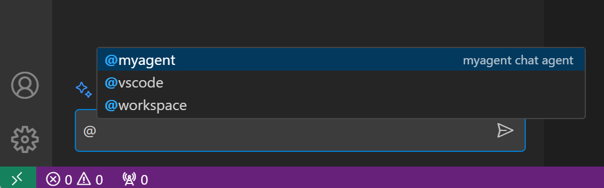

# vscode-copilot-dev
---
This project provides development tools for creating GitHub Copilot extensions for Visual Studio Code.

## Scaffold a new Copilot chat agent package:


## Usage
From a command prompt or VS Code terminal window, create a new empty directory to hold your project.  For example:

```
mkdir myagent
cd ./myagent
```

Launch the scaffolder from the npm package manager:

```
npm exec jonlester/vscode-copilot-dev
```

Once the project setup completes, launch VS Code with your new folder as the workspace:

```
code .
```

Try out your new chat agent by opening the VS Code debugging panel, and starting the "Run Extension" launch configuration:



A new VS Code window will launch, and after a moment you'll see your new agent available in Copilot Chat:



You can start customizing your chat agent by adding your code to the generated `extension.ts` file, located in the `src` folder.

> **Tip:** Take a look at this [chat agent sample](https://github.com/microsoft/vscode-extension-samples/tree/main/chat-agent-sample) to help get you started.

## Feedback
For any and all questions, issues, or just general feedback, please open an [issue](https://github.com/jonlester/vscode-copilot-dev/issues/new/choose)

## License

This project is licensed under the [MIT License](LICENSE).
